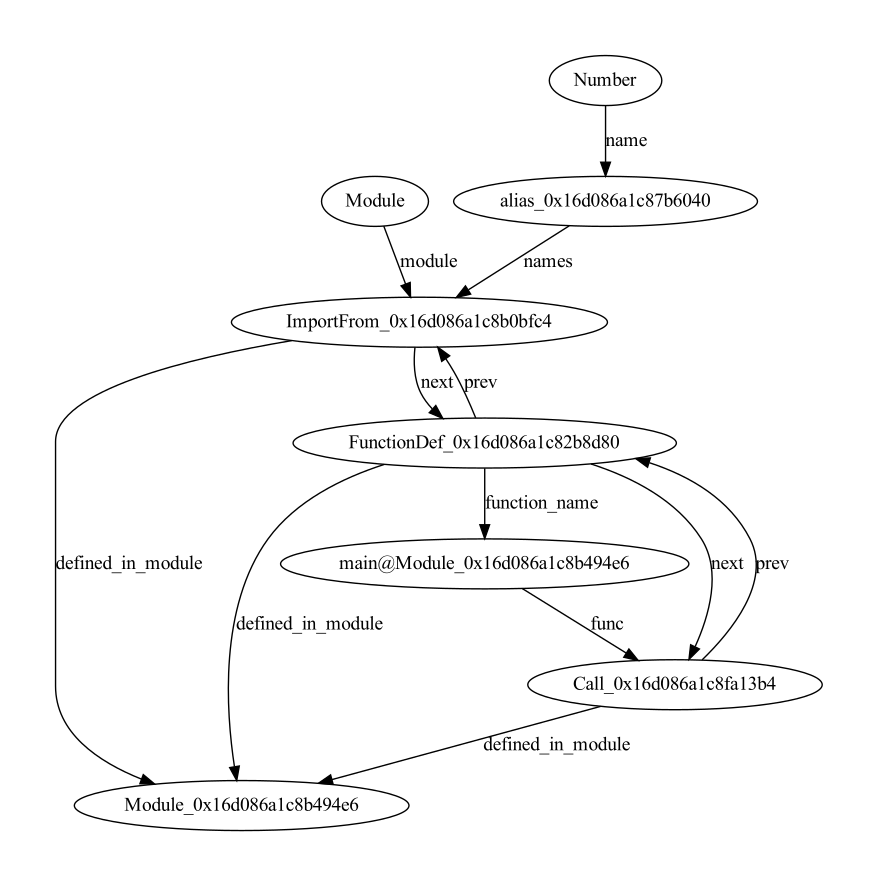
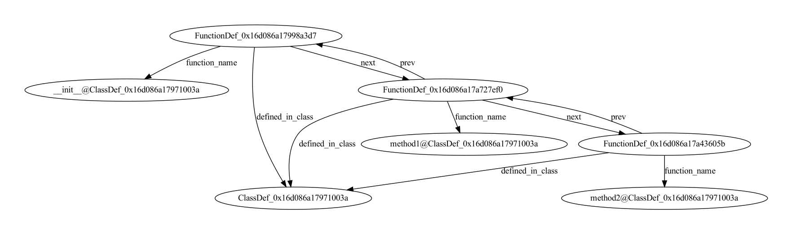
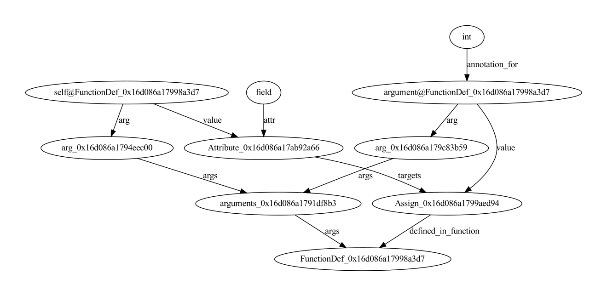
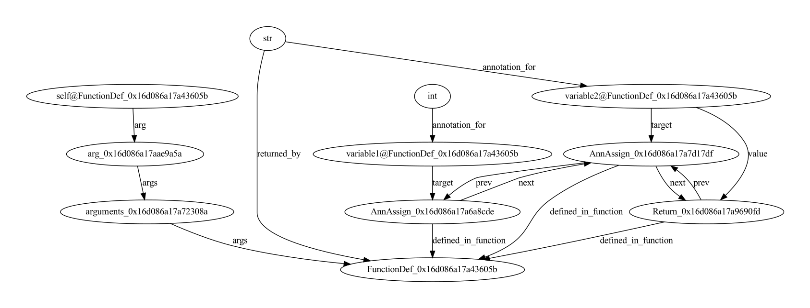
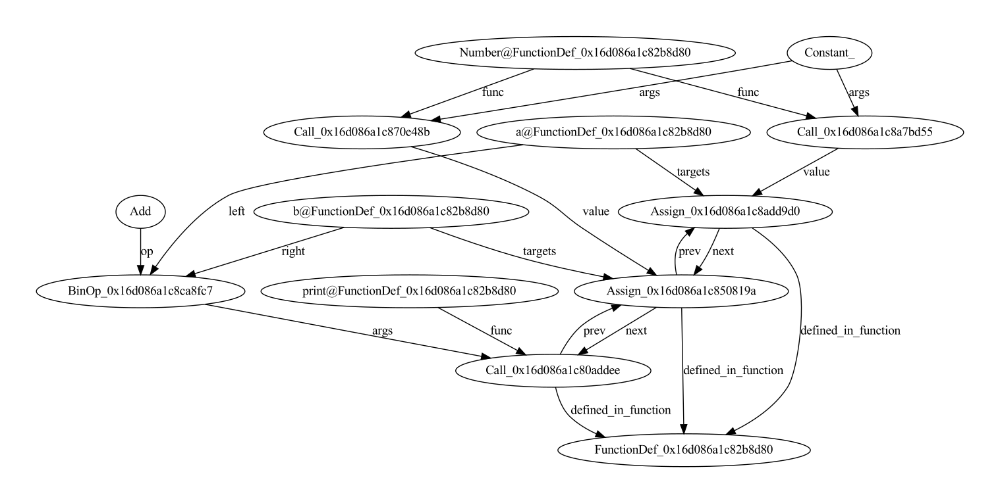

# Source Code Tools
Library for analyzing source code with graphs and NLP. What this repository can do:

1. Fetch source codes for packages in pip
2. Create indexes of python packages using [Sourcetrail](https://www.sourcetrail.com)
3. Convert Sourcetrail indexes into a connected graph
4. Build graphs for source codes from AST
5. Train Graph Neural Network for learning representations for source code
6. Predict Python types using NLP and graph embeddings

For more details consult our [wiki](https://github.com/VitalyRomanov/method-embedding/wiki).

### Instaling Python Libraries

You need to use conda, create virtual environment `SourceCodeTools` with python 3.8
```bash
conda create -n SourceCodeTools python=3.8
```

If you plan to use graphviz
```python
conda install -c conda-forge pygraphviz graphviz
```

Install CUDA 11.1 if needed
```python
conda install -c nvidia cudatoolkit=11.1
```

To install SourceCodeTools library run
```bash
git clone https://github.com/VitalyRomanov/method-embedding.git
cd method-embedding
pip install -e .
# pip install -e .[gpu]
```

### Processing Python Code

Source code should be structured in the following way
```
source_code_data    
│
└───package1
│   │───source_file_1.py
│   │───source_file_2.py
│   └───subfolder_if_needed
│       │───source_file_3.py
│       └───source_file_4.py
│   
└───package2
    │───source_file_1.py
    └───source_file_2.py
```
An example of source code data can be found in this repository `method-embedding\res\python_testdata\example_code`. A package should contain self-sufficient code with its dependencies. Unmet dependencies will be labeled as non-indexed symbol.

#### Indexing with Docker
To create dataset need to first perform indexing with Sourcetrail. The easiest way to do this is with a docker container  
```bash
docker run -it -v "/full/path/to/data/folder":/dataset mortiv16/sourcetrail_indexer
```

#### Creating graph 
Need to provide a sentencepiece model for subtokenization. Model trained on CodeSearchNet can be downloaded [here](https://www.dropbox.com/s/cw7oxkzicgnkzgb/sentencepiece_bpe.model?dl=1). 
```bash
SCT=/path/to/SourceCodeTool_repository
SOURCE_CODE=/path/to/source/code/indexed/with/sourcetrail
DATASET_OUTPUT=/path/to/dataset/output
python $SCT/SourceCodeTools/code/data/sourcetrail/DatasetCreator2.py --bpe_tokenizer sentencepiece_bpe.model --track_offsets --do_extraction $SOURCE_CODE $DATASET_OUTPUT
```

The graph dataset format is [described in wiki](https://github.com/VitalyRomanov/method-embedding/wiki/04.-Graph-Format-Description)
```
graph_dataset    
│
└───no_ast
│   │───common_call_seq.bz2
│   │───common_edges.bz2
│   │───common_function_variable_pairs.bz2
│   │───common_nodes.bz2
│   │───common_source_graph_bodies.bz2
│   └───node_names.bz2
│   
└───with_ast
    │───common_call_seq.bz2
    │───common_edges.bz2
    │───common_function_variable_pairs.bz2
    │───common_nodes.bz2
    │───common_source_graph_bodies.bz2
    └───node_names.bz2
```

`no_ast` contains graph built from global relationships only. `with_ast` contains graph with AST nodes and edges. Two main files for building the graph are `common_nodes.bz2` and `common_edges.bz2`. The files are stored as pickled pandas table (read with `pandas.read_pickle`) and probably not portable between platforms. One can view the content by converting table into the `csv` format
```bash
python $SCT/SourceCodeTools/code/data/sourcetrail/pandas_format_converter.py common_nodes.bz2 csv
```

The graph data can be loaded as pandas tables using `load_data` function
```python
from SourceCodeTools.code.data.sourcetrail.Dataset import load_data
nodes, edges = load_data(
    node_path="path/to/common_nodes.bz2",
    edge_path="path/to/common_edges.bz2"
)
```

#### Examples of graph built from AST
Module-level graph
```python
from Module import Number

def main():
    a = Number(4)
    b = Number(5)
    print(a+b)

main()
```


Class-level graph
```python
class ExampleClass:
    def __init__(self, argument: int):
        """
        Initialize. Инициализация
        :param argument:
        """
        self.field = argument

    def method1(self) -> str:
        """
        Call another method. Вызов другого метода.
        :return:
        """
        return self.method2()

    def method2(self) -> str:
        """
        Simple operations.
        Простые операции.
        :return:
        """
        variable1: int = self.field
        variable2: str = str(variable1)
        return variable2
```


Method-level graph
```python
def __init__(self, argument: int):
        """
        Initialize. Инициализация
        :param argument:
        """
        self.field = argument
```


```python
def method2(self) -> str:
        """
        Simple operations.
        Простые операции.
        :return:
        """
        variable1: int = self.field
        variable2: str = str(variable1)
        return variable2
```


```python
def main():
    a = Number(4)
    b = Number(5)
    print(a+b)
```

